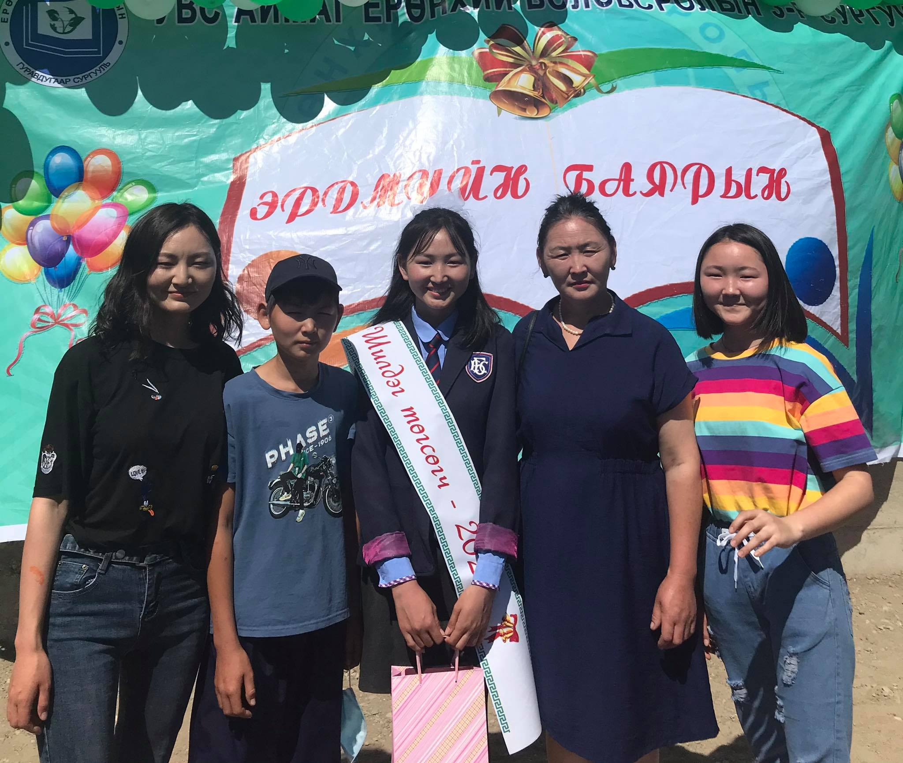

<html>
   <head>

   	<meta charset="utf-8">
   	<title>Танилцуулга</title>
   </head>
   <body style="background-color:lightpink;">
   	
   			
   
	
   <h1>Гэр бүл</h1>

  

Ээж, эгч, 2 дүүгийн хамт амьдардаг. Ээж минь цагаан өмсгөл өмссөн баатар. Харин эгч минь дөнгөж л оюутны ширээнээс амьдралд хөл тавин ажлын гараагаа эхэлсэн шинэхэн төгсөгч. Харин 2 дүү минь хоёулаа төгсөх ангийн сурагчид нэг нь 9-р ангиа нөгөө нь 12-р ангиа төгсөж байгаа. 
  Ээж: Мядагбадам 
  Эгч: Удвал
  Эмэгтэй дүү: Сувд
  Эрэгтэй дүү: Дөлгөөн

</body>
</html>