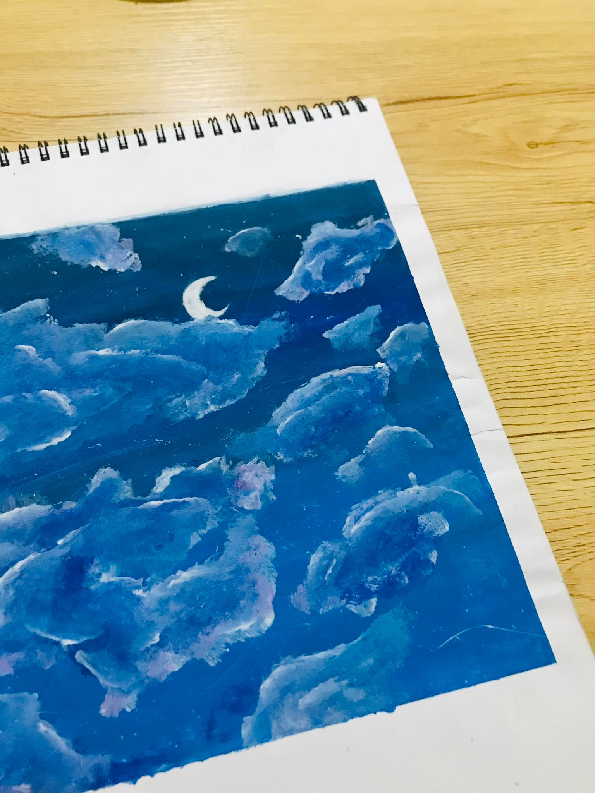
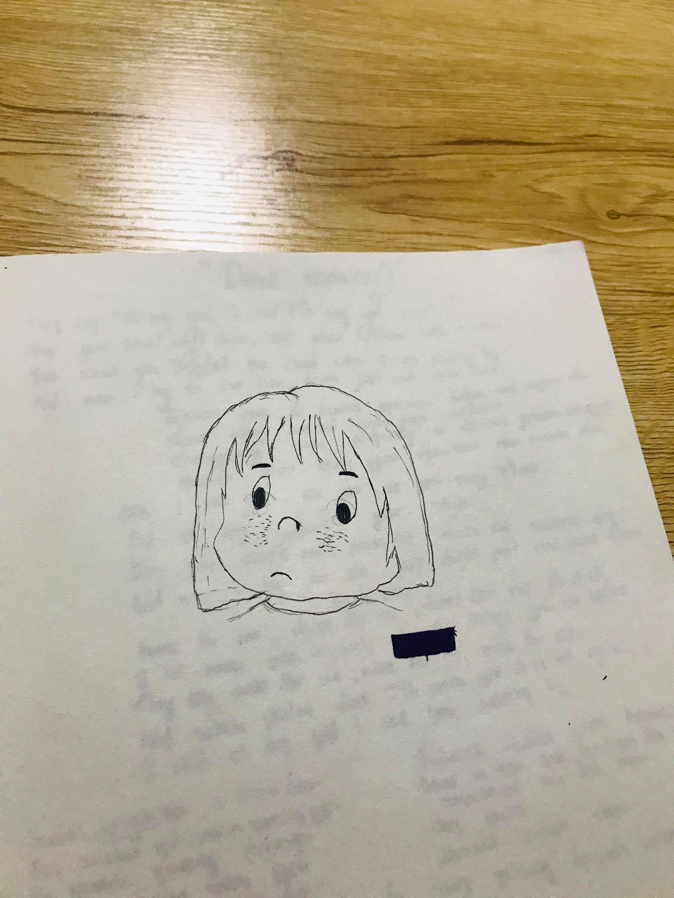
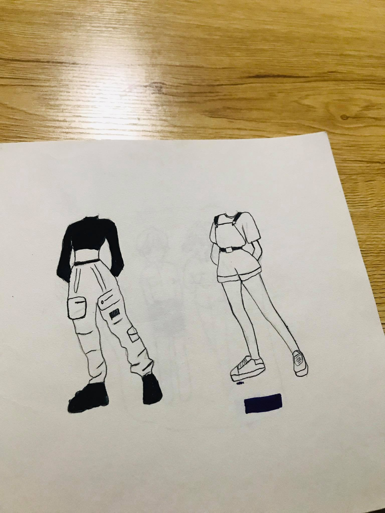
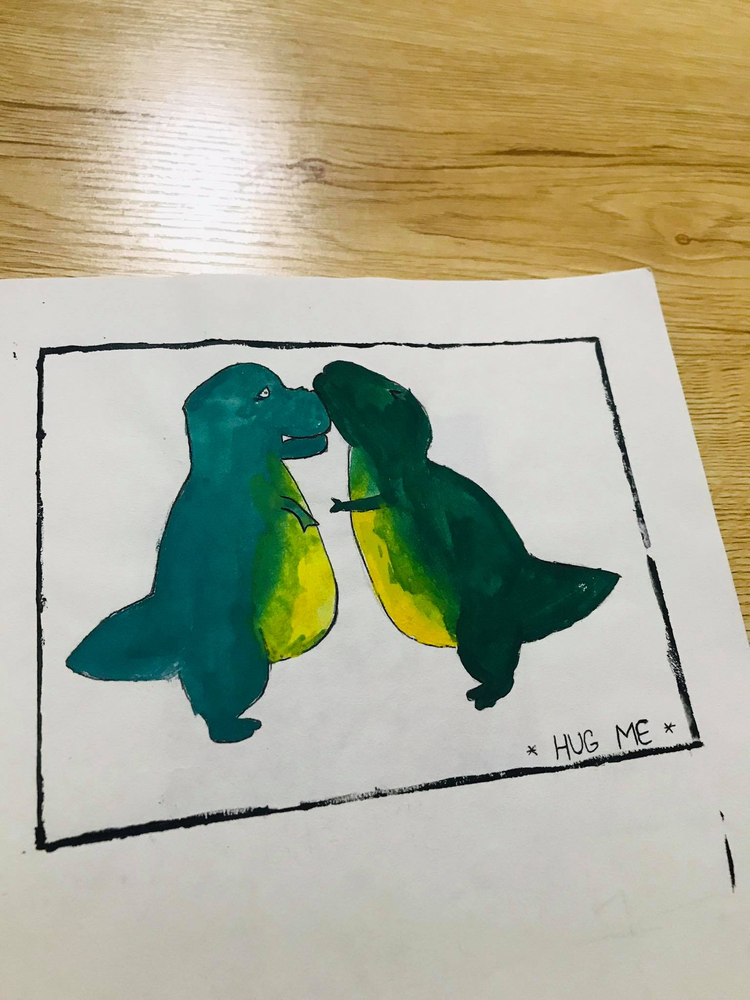
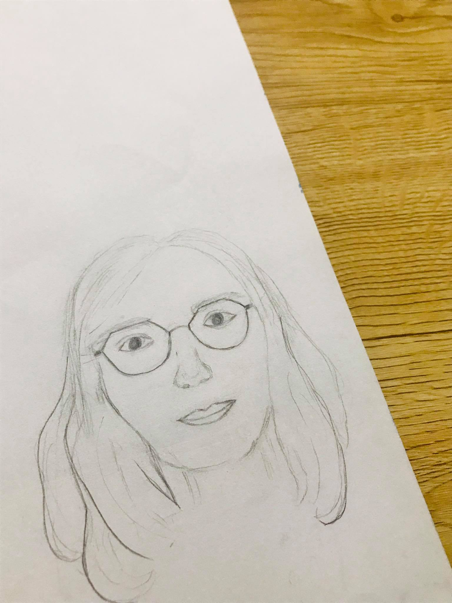

<html>
<head>
   <meta charset="utf-8">
   <title>Танилцуулга</title>
   </head>
   <body style="background-color:lightpink;">
      
   
   <h1>
      Миний хобби
   </h1>
   

   	Хобби гэдгийг хүмүүс маш олон утгаар ойлгодог гэж би бодож байна. Харин миний бодлоор хобби гэдэг ном унших, bujo хөтлөхөөс арай өөр. Нэг ёсондоо байнга хийдэг зүйлээс өөр гэж хэлж болох юм.
     
<strong>Миний хобби бол зураг зурах.</strong>

       
      
      
      
      
     Магадгүй үүнийг уншаад та намайг маш сайн зураг зурдаг юм байна гэж ойлгож болох юм. Гэвч би тийм сайн зурдаггүй зүгээр л doodle эсвэл youtube дэх зураг зурах бичлэг дагаж зурдаг. Хобби бол хийж буй тэр зүйлээсээ таашаал авч сэтгэл хөдлөлийг нь тогтворжуулж өгдөг. Тиймдээ ч би зураг зурж байхдаа уурласан бол тайвширч, гомдсон бол сэтгэл онгойж ер нь л тайвшруулагч эм болдог.  

      
   	
</body>
   </html>